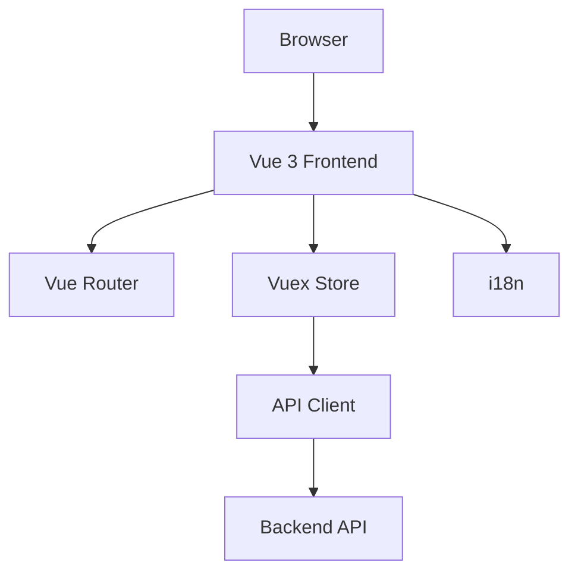

# 🏗️ Keshta Company System

EN: Construction Company Management System built with Vue 3 + Tailwind + i18n | AR: نظام إدارة شركة مقاولات مبني باستخدام Vue 3 + Tailwind + i18n

[](https://vuejs.org/)
[](https://tailwindcss.com/)
[](https://kazupon.github.io/vue-i18n/)

## 📑 Table of Contents

EN: Jump to section: | AR: انتقل إلى القسم:

- [Features](#-features--المميزات)
- [Architecture](#-architecture--البنية)
- [Installation](#-installation--التثبيت)
- [Configuration](#-configuration--الإعدادات)
- [Usage](#-usage--الاستخدام)
- [API Reference](#-api-reference--مرجع-api)
- [Database Schema](#-database-schema--مخطط-قاعدة-البيانات)
- [Development](#-development--التطوير)
- [Security](#️-security--الأمان)
- [Contributing](#-contributing--المساهمة)
- [License](#-license--الترخيص)

## ✨ Features / المميزات

EN: Core features: | AR: المميزات الأساسية:

- **Authentication** | **المصادقة**
  - EN: Login with username/password | AR: تسجيل الدخول باسم المستخدم/كلمة المرور
  - EN: Language switcher (🇺🇸/🇪🇬) | AR: تبديل اللغة (🇺🇸/🇪🇬)
  - EN: Responsive design using TailwindCSS | AR: تصميم متجاوب باستخدام TailwindCSS

- **Dashboard** | **لوحة التحكم**
  - EN: Main Dashboard with dynamic components | AR: لوحة تحكم رئيسية بمكونات ديناميكية
  - EN: Sidebar and top navbar for navigation | AR: شريط جانبي وأعلى للتنقل
  - EN: Multi-language support (Arabic/English) | AR: دعم متعدد اللغات (العربية/الإنجليزية)

- **Contractors Management** | **إدارة المقاولين**
  - EN: Add, edit, and import contractors from Excel | AR: إضافة وتعديل واستيراد المقاولين من Excel
  - EN: Search by name or phone | AR: البحث بالاسم أو الهاتف
  - EN: Notifications after import | AR: إشعارات بعد الاستيراد

- **Supplies Module** (قيد التطوير) | **نموذج التوريدات** (قيد التطوير)
  - EN: Add new supply with details | AR: إضافة توريدة جديدة مع التفاصيل
  - EN: Fields for location, date, contractor, vehicle, etc. | AR: حقول للموقع، التاريخ، المقاول، السيارة، إلخ.
  - EN: Buttons for add row, save, cancel | AR: أزرار لإضافة صف، حفظ، إلغاء

## 🏛 Architecture / البنية

EN: The system follows a modern Vue 3 architecture: | AR: يتبع النظام بنية Vue 3 حديثة:



## 🚀 Installation / التثبيت

### 1. Clone the project / استنساخ المشروع
```bash
git clone https://github.com/USERNAME/keshta-company-system.git
cd keshta-company-system
```

### 2. Install dependencies / تثبيت الاعتمادات
```bash
npm install
```

### 3. Run the project / تشغيل المشروع
```bash
npm run serve
```

### 4. Open in browser / فتح في المتصفح
Go to `http://localhost:8080` / اذهب إلى `http://localhost:8080`

## ⚙️ Configuration / الإعدادات

### Environment Variables / متغيرات البيئة

```env
# Required / مطلوب
VUE_APP_API_URL=http://localhost:3000
VUE_APP_DEFAULT_LOCALE=en

# Optional / اختياري
VUE_APP_TITLE=Keshta Co.
VUE_APP_DEBUG=false
```

## 🛠 Usage / الاستخدام

- EN: Access the login page, enter credentials, and switch languages to test i18n.
- AR: الوصول إلى صفحة تسجيل الدخول، إدخال بيانات الاعتماد، وتبديل اللغات لاختبار i18n.

## 📚 API Reference / مرجع API

- EN: The API endpoints are defined in `src/api.js`.
- AR: نقاط نهاية API معرفة في `src/api.js`.

## 🗄 Database Schema / مخطط قاعدة البيانات

- EN: The database schema is not included in this version.
- AR: مخطط قاعدة البيانات غير متوفر في هذه النسخة.

## 🔧 Development / التطوير

- EN: Use `npm run serve` for development with hot-reloading.
- AR: استخدم `npm run serve` للتطوير مع إعادة تحميل ساخنة.

## 🔒 Security / الأمان

- EN: Ensure to set `VUE_APP_API_URL` to your backend API URL.
- AR: تأكد من تعيين `VUE_APP_API_URL` على عنوان URL الخاص بواجهة برمجة التطبيقات الخلفية.

## 🤝 Contributing / المساهمة

- EN: Contributions are welcome! Please submit a PR or issue.
- AR: المساهمات مرحب بها! يرجى تقديم طلب سحب أو مشكلة.

## 📜 License / الترخيص

- EN: This project is licensed under the MIT License.
- AR: هذا المشروع مرخص بموجب رخصة MIT.


